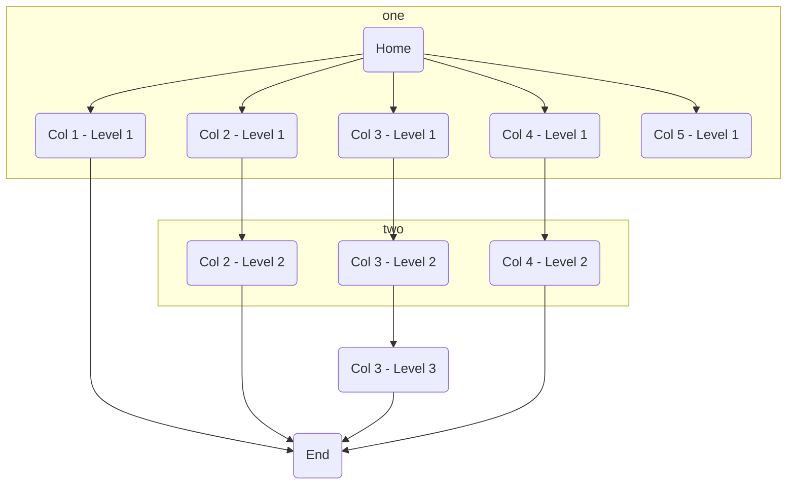

```mermaid
      flowchart TD
      subgraph one
        A(Home)-->B(Col 1 - Level 1)
        A-->C(Col 2 - Level 1)
        A-->G(Col 3 - Level 1)
        A-->J(Col 4 - Level 1)
        A-->L(Col 5 - Level 1)
      end
      subgraph two
        C-->F(Col 2 - Level 2)
        J-->K(Col 4 - Level 2)
        G-->H(Col 3 - Level 2)
      end
        H-->I(Col 3 - Level 3)
        B-->E(End)
        F-->E
        I-->E
        K-->E
```

## Examples
- [Mermaid Example](mermaid-example.md)
